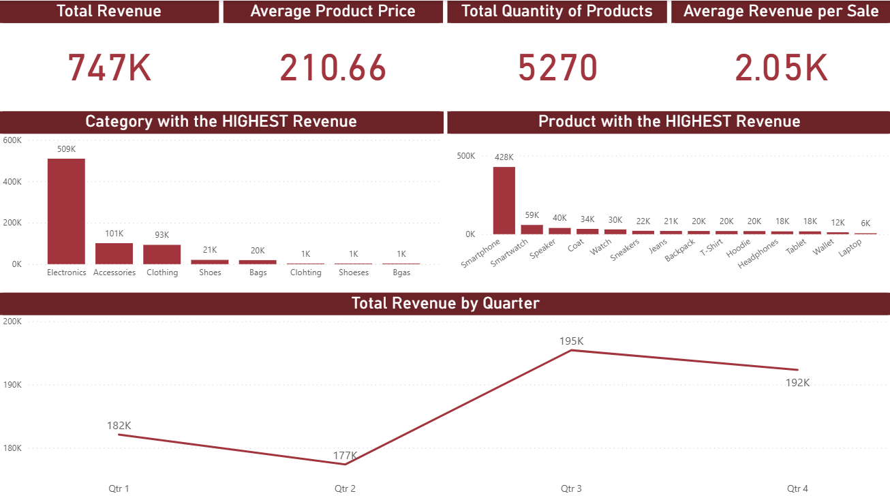

# Sales Data Dashboard 📊

> A Power BI dashboard analyzing 747K in total revenue across product categories and quarters, built on a Python-cleaned dataset to uncover top-performing categories, highest-revenue products, and seasonal sales trends.

---

## 📌 Overview

This dashboard was built to give sales teams a clear view of product performance across categories and time periods. It answers key questions about which categories and products generate the most revenue, how sales fluctuate across quarters, and where pricing and volume opportunities exist.

The data was cleaned using Python before being loaded into Power BI, ensuring accurate and reliable insights across all visuals.

---

## 🖼️ Dashboard Preview

---

## 🔍 Key Insights

- Total revenue reached **747K** across **5,270 total products** with an average revenue per sale of **2.05K**
- **Electronics** dominates all categories with **509K in revenue**, representing the majority of total sales
- **Accessories** and **Clothing** rank second and third with **101K** and **93K** respectively
- **Smartphone** is the top product by revenue at **428K**, followed by **Smartwatch** at **428K** and **Speaker** at **59K**
- **Q3** records the highest quarterly revenue at **195K**, followed closely by Q4 at **192K**
- **Q2** is the weakest quarter at **177K**, suggesting a mid-year seasonal dip
- Average product price across all sales is **210.66**

---

## 🧹 Data Cleaning (Python Notebook)

The raw dataset was cleaned using Python before being loaded into Power BI:

- Inspected dataset structure, column names, data types, and descriptive statistics
- Identified and dropped all rows with null values
- Detected and removed duplicate rows
- Identified misspelled category names in the raw data including "Clohting", "Shoeses", and "Bgas"
- Exported the cleaned dataset as `cleaned sales_data.csv` ready for Power BI import

---

## ⚙️ DAX Measures

| Measure | Description |
|---------|-------------|
| `Total Revenue` | Sum of total revenue across all sales |
| `Average Product Price` | Average price per product |
| `Total Quantity of Products` | Sum of all product quantities sold |
| `Average Revenue per Sale` | Average revenue generated per transaction |

---

## 🛠️ Tools and Techniques

| Tool | Usage |
|------|-------|
| **Power BI Desktop** | Dashboard design, data modeling, DAX measures |
| **Python (Pandas)** | Data cleaning and preparation |
| **Jupyter Notebook** | Data cleaning workflow |

**Visualizations used:** KPI cards, Vertical bar charts, Line chart

---

## 📁 Dataset

The dataset contains product sales records including product name, category, quantity, price, and revenue.

📂 [Raw Dataset](data/sales_data.csv)
📂 [Cleaned Dataset](data/cleaned%20sales_data.csv)
